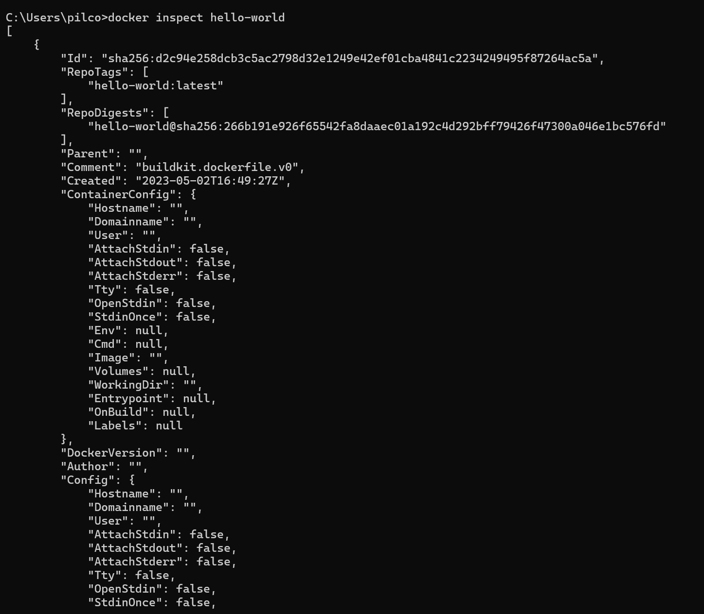
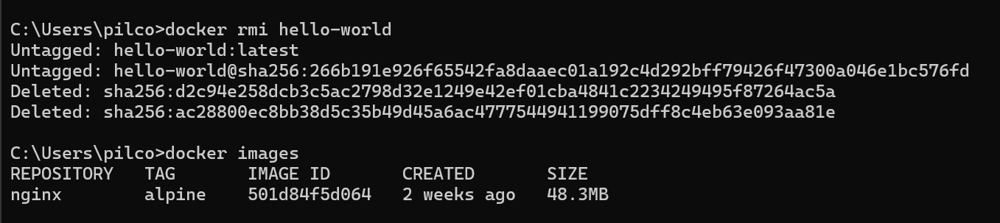

# Imagen
Es un archivo único que contiene todos los programas, librerías, dependencias y configuraciones necesarias para instalar y/o ejecutar una aplicación o un conjunto de aplicaciones.


## ¿Cuál es la relación entre una imagen y un contenedor? 
En el contexto de Docker, las imágenes son archivos de solo lectura que contienen todo lo necesario para ejecutar una aplicación, como el código, bibliotecas y configuraciones. Los contenedores, por otro lado, son instancias en ejecución de estas imágenes, que heredan todas sus propiedades y permiten ejecutar la aplicación de manera aislada y portátil. La relación entre ambos es que las imágenes actúan como plantillas o moldes para crear los contenedores, definiendo el entorno de ejecución, mientras que los contenedores son las instancias activas que corren la aplicación dentro de ese entorno definido por la imagen. En resumen, la imagen es la definición y el contenedor es la ejecución activa de esa definición.


## Comandos para imágenes

### Descargar imagen
Descarga la última versión de la imagen disponible en el registro de Docker.

```
docker pull <nombre imagen> 
```

Descarga una versión específica de la imagen, cada imagen tiene etiquetas (tags) para diferentes versiones.
Una imagen puede tener la etiqueta latest para representar la última versión, si no se especifica una etiqueta se hará referencia a la versión latest.

```
docker pull <nombre imagen>:<tag>
```

### Descargar la imagen **hello-world**

docker pull hello-world

**¿Qué es nginx**

Es un servidor web y proxy inverso de código abierto que se utiliza para servir contenido web de manera eficiente y manejar múltiples conexiones simultáneamente. Desarrollado originalmente por Igor Sysoev, Nginx es conocido por su alto rendimiento, estabilidad y bajo consumo de recursos. 

### Descargar la imagen  **nginx** en la versión **alpine**

docker pull nginx:alpine

### Listar imágenes

```
docker images
```

# COLOCAR UNA CAPTURA DE PANTALLA DEL RESULTADO 


**Identificadores**

En Docker, se utilizan varios identificadores para diferenciar de manera única los elementos del sistema, como imágenes, contenedores, volúmenes y redes. Estos identificadores son generados automáticamente por Docker y son únicos dentro del contexto del sistema Docker en el que se encuentran. 

### Inspeccionar una imagen
El comando docker inspect se utiliza para obtener información detallada sobre un objeto de Docker específico, como un contenedor, una imagen, un volumen o una red.  Proporciona información en formato JSON sobre el objeto especificado.

```
docker inspect <nombre imagen>
docker inspect <nombre imagen>:<tag>
```

Inspeccionar la imagen hello-world 



**¿Con qué algoritmo se está generando el ID de la imagen**

El ID de la imagen en Docker se genera utilizando un algoritmo hash criptográfico, específicamente SHA-256 (Secure Hash Algorithm 256-bit). Este algoritmo produce un valor hash único de 256 bits para la imagen, garantizando su integridad y unicidad.

Aquí un ejemplo del ID:

```
[
    {
        "Id": "sha256:d2c94e258dcb3c5ac2798d32e1249e42ef01cba4841c2234249495f87264ac5a",
        ...
    }
]
```

### Filtrar imágenes

```
docker images | grep <termino a buscar>

```

### Para eliminar una imagen
Eliminar permanentemente la imagen de tu sistema Docker.

```
docker rmi <nombre imagen>:<tag>
```

Eliminar la imagen hello-world 



-f: Es la opción para forzar la eliminación de la imagen incluso si hay contenedores en ejecución que utilizan esa imagen.
Cuando eliminas una imagen Docker, Docker no elimina automáticamente los contenedores que se han creado a partir de esa imagen. Esto significa que, aunque hayas eliminado la imagen, el contenedor seguirá ejecutándose normalmente.  
**Considerar**
Eliminar una imagen no afecta a los contenedores que se han creado a partir de esa imagen, a menos que esos contenedores dependan de archivos o configuraciones específicas de la imagen eliminada. En ese caso, es posible que los contenedores se comporten de manera inesperada después de eliminar la imagen.
Es una buena práctica detener y eliminar todos los contenedores que dependan de una imagen antes de eliminar la imagen en sí.

```
docker rmi -f <nombre imagen>:<tag>
```

